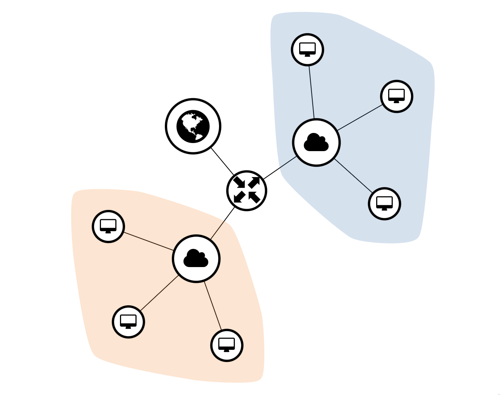

# Terraform RKE2 OpenStack

[](https://registry.terraform.io/modules/zifeo/rke2/openstack/latest)

Easily deploy a RKE2 Kubernetes cluster on OpenStack providers (e.g. [Infomaniak](https://www.infomaniak.com/fr/hebergement/public-cloud), [OVH](https://www.ovhcloud.com/fr/public-cloud/), etc.).

Inspired and reworked from [remche/terraform-openstack-rke2](https://github.com/remche/terraform-openstack-rke2) to add an easier interface, stricter security groups, persistent storage and S3 automated etcd snapshots.

## Features

- [RKE2](https://docs.rke2.io) Kubernetes distribution : lightweight, stable, simple and secure
- persisted `/var/lib/rancher/rke2` for (single) server durability
- configure OpenStack Swift or another S3 comptatible backend for automated etcd snapshots
- smooth updates & agent nodes autoremoval



### Next

- [autoscaling](./example/autoscaling-tests.yaml) via HEAT
- [loadbalancer](https://github.com/kubernetes/cloud-provider-openstack/blob/master/docs/octavia-ingress-controller/using-octavia-ingress-controller.md) auto-provisionning
- distinct subnets for servers and agents
- gpu bindings

## Getting started

```bash
cat <<EOF > cluster.tf
provider "openstack" {
  tenant_name = "PCP-XXXXXXX"
  user_name   = "PCU-XXXXXXX"
  password    = "XXXXXXXXXXX"
  auth_url    = "https://api.pub1.infomaniak.cloud/identity"
  region      = "dc3-a"
}

module "rke2" {
  source  = "zifeo/rke2/openstack"

  name = "k8s"

  public_net_name = "ext-floating1"
  rules_ext = [
    { "port" : 22, "protocol" : "tcp", "source" : "0.0.0.0/0" },
    { "port" : 80, "protocol" : "tcp", "source" : "0.0.0.0/0" },
    { "port" : 443, "protocol" : "tcp", "source" : "0.0.0.0/0" },
    { "port" : 6443, "protocol" : "tcp", "source" : "0.0.0.0/0" },
  ]

  server = {
    nodes_count = 1

    flavor_name      = "a2-ram4-disk0"
    image_name       = "Ubuntu 20.04 LTS Focal Fossa"
    system_user      = "ubuntu"
    boot_volume_size = 8

    rke2_version     = "v1.21.5+rke2r2"
    rke2_volume_size = 16
  }

  agents = [
    {
      name        = "pool-a"
      nodes_count = 1

      flavor_name      = "a2-ram4-disk0"
      image_name       = "Ubuntu 20.04 LTS Focal Fossa"
      system_user      = "ubuntu"
      boot_volume_size = 8

      rke2_version     = "v1.21.5+rke2r2"
      rke2_volume_size = 16
    }
  ]
}

terraform {
  required_providers {
    openstack = {
      source  = "terraform-provider-openstack/openstack"
    }
  }
}
EOF

terraform init
terraform apply
# or, on upgrade, to process node by node
terraform apply -parallelism=1
```

## Infomaniak OpenStack [example](./example/main.tf)

A stable, performent and fully-equiped Kubernetes cluster in Switzerland for as little as CHF 11.—/month (at the time of writing):
- nginx-ingress with floating ip (perfect under Cloudflare proxy)
- persistence through cinder-csi storage classes (retain, delete)
- 1 server 1cpu/2go (= master)
- 1 agent 1cpu/2go (= worker)

Quick benchmarks confirmed that the price/performance outperforms Scaleway offering (but would need to be deepened).

| Flavour                                                      | CHF/month |
|--------------------------------------------------------------|-----------|
| 2×2.93 (instances) + 0.09×2×(4+6) (blockstorage) + 3.34 (IP) | 11.—      |
| single 2cpu/4go server with 1x4cpu/8go worker                | ~25.—     |
| 3x2cpu/4go HA servers with 1x4cpu/8go worker                 | ~40.—     |
| 3x2cpu/4go HA servers with 3x8cpu/16go workers               | ~100.—    |

```bash
git clone git@github.com:zifeo/terraform-openstack-rke2.git && cd terraform-openstack-rke2/example
cat <<EOF > terraform.tfvars
tenant_name = "PCP-XXXXXXX"
user_name   = "PCU-XXXXXXX"
password    = "XXXXXXXXXXX"
EOF
terraform init
terraform apply # approx 2-3mins
kubectl --kubeconfig rke2.yaml get nodes
# NAME           STATUS   ROLES                       AGE     VERSION
# k8s-pool-a-1   Ready    <none>                      119s    v1.21.5+rke2r2
# k8s-server-1   Ready    control-plane,etcd,master   2m22s   v1.21.5+rke2r2
helm install wordpress --values wordpress.yaml --namespace default bitnami/wordpress
kubectl --kubeconfig rke2.yaml get pods -n default
# NAME                         READY   STATUS    RESTARTS   AGE
# wordpress-7474ddb77f-w6c86   1/1     Running   0          102s
# wordpress-mariadb-0          1/1     Running   0          102s
curl -s $(terraform output -raw floating_ip) -H 'host: wordpress.local' | grep Welcome
# <p>Welcome to WordPress. This is your first post. Edit or delete it, then start writing!</p>
```

See their technical [documentation](https://docs.infomaniak.cloud) and [pricing](https://www.infomaniak.com/fr/hebergement/public-cloud/tarifs).

## More on RKE2 & OpenStack

[RKE2 cheatsheet](https://gist.github.com/superseb/3b78f47989e0dbc1295486c186e944bf)

```
# debug on nodes
alias docker=sudo /var/lib/rancher/rke2/bin/crictl -r /run/k3s/containerd/containerd.sock
```
